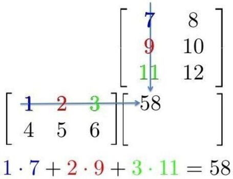
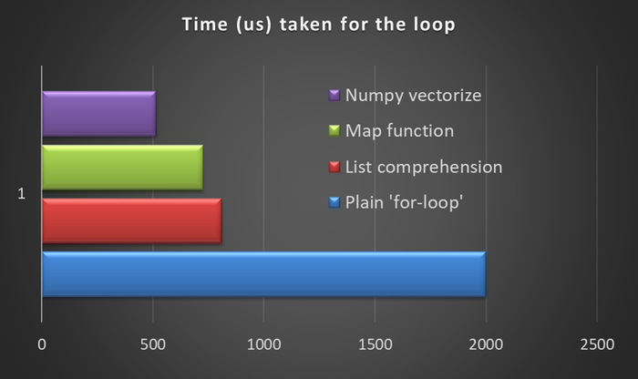
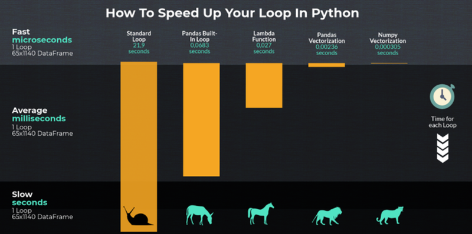
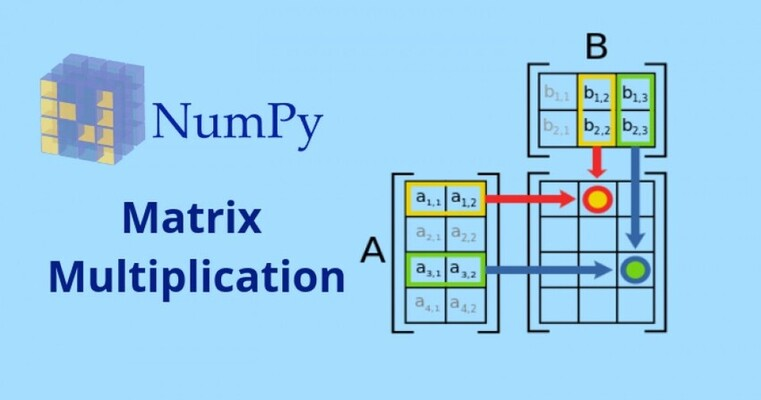
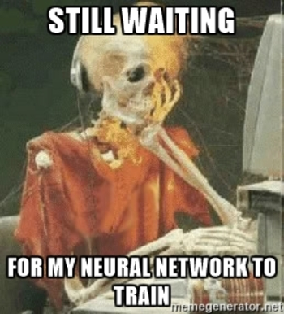
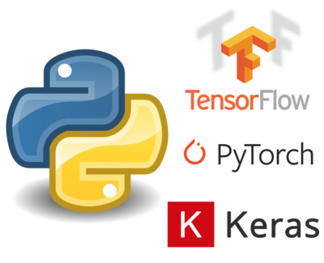
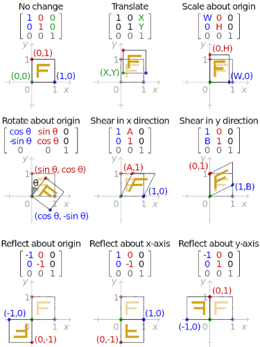
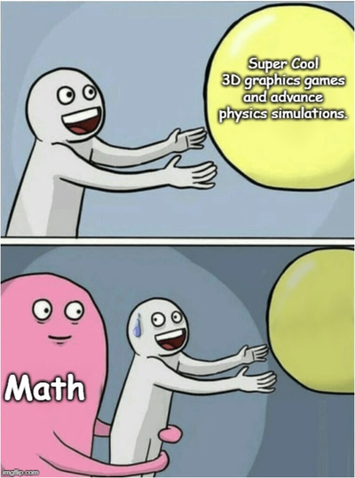
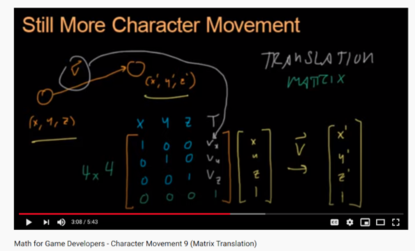

Operator Overloading
--------------------


### Cringeworthy equations

* In Java and JS, representing Mathematical objects such as fractions have this off-putting syntax

```js
const f1 = new Fraction(3, 2)
const f2 = new Fraction(3, 2)
const f3 = new Fraction(3, 2)

f1.add(f2).multiply(f3)  // (f1 + f2) * f3
```

* 👆 **NOT** PEMDAS, addition comes first before multiplication 😭😭😭

```js
f1.add(f2.multiply(f3)) // f1 + f2 * f3
```


### Readable math-heavy code?

* Remember that ML is math-heavy
  - the math doesn't refer to `integer`s and `float`s
  + matrices




### Why matrices? (1/7)

* Good matrix libs support parallel computations
  - using matrices over for-loops: __vectorization__




### Why matrices? (2/7)

* You don't want to wait 5 years to train your model
  - Numpy is way faster, and it doesn't even use GPUs




### Why matrices? (3/7)

* Good matrix libs support parallel computations
  - using matrices over for-loops: __vectorization__


### Why matrices? (4/7)

* The red box can perform multiplication **in parallel** with the green box




### Why matrices? (5/7)

* Lots of matrix elements can be computed concurrently and independently from one another


### Why matrices? (6/7)

* Without linear algebra, large-scale (FANG-scale) ML wouldn't be feasible




### Why matrices? (7/7)

* Pytorch uses GPU, can replace the CPU-only Numpy
  - https://pytorch.org/tutorials/beginner/blitz/tensor_tutorial.html
* Tensorflow is one of the top ML libs, and [can use GPUs](https://www.tensorflow.org/install/gpu)




### Games use matrices and GPUs! (1/3)




### Games use matrices and GPUs! (2/3)




### Games use matrices and GPUs! (3/3)

* 3D-models of game characters and objects are made up of vertices that make up polygons
  - parallel matrix ops (e.g. move/translate) on those points




### Operator Overloading

* Allows us to use `+`, `-`, `*`, etc. for number-like objects
  - [fractions](https://docs.python.org/3.8/library/fractions.html)
  - [complex numbers](https://docs.python.org/3.8/library/cmath.html)
  - [date and time]()
  - [matrices](https://numpy.org/doc/stable/user/quickstart.html#basic-operations)

```python
complex(5, 3) + complex(9, -1)  # (14+2j)

answer = Fraction(1, 2) + Fraction(2, 5) * Fraction(9, 2)
print(answer) # Fraction(23, 10), oh look! PEMDAS!

datetime(2020, 9, 3, 16, 30) + timedelta(days=2, hours=5)
# datetime.datetime(2020, 9, 5, 21, 30)

datetime(2020, 9, 3, 16, 30) - datetime(2020, 8, 30, 10, 0)
# datetime.timedelta(days=4, seconds=23400) # 4d 6.5h
```


### Operator Overloding demo

* Let's create the `Fraction` class from scratch
  * I do Fraction, you do Matrix in ProbSet 01, deal?

<div style="display: flex; align-items: center; justify-content: center">
  <div style="margin-right: 64px">
    <ul>
      <li>Your `Matrix` class will not be multiplying in parallel</li>
      <li>
        More of experiencing and understanding how mathematical objects work with
        <code>+</code>, <code>-</code>, <code>*</code>, etc.
      </li>
      <li>No need to be super complete</li>
    </ul>
  </div>
  
</div>


### Languages do it differently (1/2)

* Dart uses the `operator` keyword

```dart [1-11 | 6-7 | 12-19 | 17-18]
class Vector {
  final int x, y;

  Vector(this.x, this.y);

  Vector operator +(Vector v) => Vector(x + v.x, y + v.y);
  Vector operator -(Vector v) => Vector(x - v.x, y - v.y);

  // Operator == and hashCode not shown
  // ···
}

void main() {
  final v = Vector(2, 3);
  final w = Vector(2, 2);

  assert(v + w == Vector(4, 5));
  assert(v - w == Vector(0, 1));
}
```


### Languages do it differently (2/2)

* Python uses [magic methods](https://medium.com/fintechexplained/advanced-python-what-are-magic-methods-d21891cf9a08)

<pre><code class="hljs python" data-trim data-line-numbers="1-13 | 6-10 | 15-18 | 17-18">
class Vector:
  def __init__(self, x, y):
    self.x = x
        self.y = y

    def __add__(self, v):
        return Vector(self.x + v.x, self.y + v.y)

    def __sub__(self, v):
        return Vector(self.x - v.x, self.y - v.y)

    def __repr__(self):
        return f"Vector({self.x}, {self.y})"

v = Vector(2, 3)
w = Vector(2, 2)
print(v + w) # Vector(4, 5)
print(v - w) # Vector(0, 1)
</code></pre>


### Fraction class, incomplete

<pre><code class="hljs python" data-trim data-line-numbers="1-7 | 9-12 | 14-23 | 25-26 | 28-29 | 31-38 | 40-50 | 52-53 | 55-60">
import math

class Fraction:
    def __init__(self, numerator, denominator):
        self.numerator = numerator
        self.denominator = denominator
        self.simplify()

    def simplify(self):
        gcd = math.gcd(self.numerator, self.denominator)
        self.numerator //= gcd
        self.denominator //= gcd

    def __add__(self, other):
        if isinstance(other, int):
            other = Fraction(other, 1)

        numerator = \
            self.numerator * other.denominator + \
            self.denominator * other.numerator
        denominator = self.denominator * other.denominator

        return Fraction(numerator, denominator)

    def __neg__(self):
        return Fraction(-self.numerator, self.denominator)

    def __sub__(self, other):
        return self.__add__(-other)

    def __mul__(self, other):
        if isinstance(other, int):
            other = Fraction(other, 1)

        numerator = self.numerator * other.numerator
        denominator = self.denominator * other.denominator

        return Fraction(numerator, denominator)

    def __radd__(self, other):
        return self.__add__(other)

    def __rsub__(self, other):
        if isinstance(other, int):
            other = Fraction(other, 1)

        return other.__sub__(self)

    def __rmul__(self, other):
        return self.__mul__(other)

    def __repr__(self):
        return f"Frac({self.numerator}/{self.denominator})"

print(1 - Fraction(1, 4))
print(Fraction(3, 4) + 2)
print(Fraction(1, 2) + Fraction(3, 10))
print(Fraction(1, 2) + Fraction(3, 10) * Fraction(5, 2))
print(4 - 3 * Fraction(7, 10))
Fraction(1, 2) + Fraction(3, 10) * Fraction(5, 2))
</code></pre>

<pre style="font-size: 0.5em">
Frac(3/4)
Frac(11/4)
Frac(4/5)
Frac(5/4)
Frac(19/10)
</pre>