Tools and Libraries
-------------------


#### Tools and Libraries for Data Science and ML

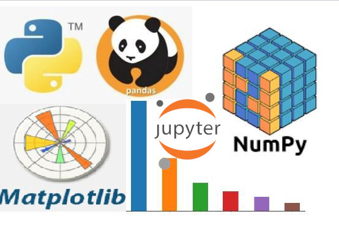

We'll be using these to code ML algos from scratch


### Numpy Flex (1/3)

* stands for Numerical Python
* tons of Math functions and objects (e.g. matrices)
  - might even replace your sci-cal during online classes

`$$ 3x + 2y - 5z = 43 $$`
`$$ 2x + 9y + \frac{1}{2}z = 67 $$`
`$$ x - y - z = 0 $$`

* How do you solve this, typically?
  - substitution with `x = y + z` is one fast choice
  - how about a generic approach, in case numbers look evil?


### Numpy Flex (2/3)

`$$
A = \begin{bmatrix}
3 & 2 & -5 \\
2 & 9 & \frac{1}{2} \\
1 & -1 & -1
\end{bmatrix}
b = \begin{bmatrix}
43 \\
67 \\
0
\end{bmatrix}
$$`

```python
import numpy as np # np is the well-established convention
coefficients = np.array([
  [3, 2, -5],
  [2, 9, 0.5],
  [1, -1, -1]
])
constants = np.array([43, 67, 0]).T
solution = np.linalg.solve(coefficients, constants)
print(solution) # [ 3.  7. -4.] 😱😱😱
```

* [Can't I use A and b for small exercises?](https://stackoverflow.com/questions/46841896/why-are-some-python-variables-uppercase-whereas-others-are-lowercase#comment80631766_46841942)
* [Bigger projects = PEP-8](https://towardsdatascience.com/data-scientists-your-variable-names-are-awful-heres-how-to-fix-them-89053d2855be)


### Numpy Flex (3/3)

* Determinants and inverses, hehehe

`$
A = \begin{bmatrix}
3 & 3 & 2 \\
-2 & 1 & 5 \\
4 & -3 & -12
\end{bmatrix}, det(A) = ?
$`

```python
import numpy as np
from numpy.linalg import inv, det

A = np.array([
  [3, 3, 2],
  [-2, 1, 5],
  [4, -3, -12]
])

print(det(A)) # 1, almost: floats are inaccurate
print(A @ inv(A)) # 3.55271368e-14 7.10542736e-15 almost 0s
print(np.round(A @ inv(A))) # identity matrix!
```


### Matplotlib Flex (1/2)

* It can plot and graph stuff
* Let's graph a parabola `$ y = x^2 + 4 $`
  - this graph will not appear in ordinary Python shell
  - use IPython or Jupyter notebooks

```bash
$ ipython -pylab
```

```python
In [1]: x = np.arange(-10, 11) # from -10 to 10

In [2]: y = x**2 + 4

In [3]: plot(x, y)
Out[3]: [&lt;matplotlib.lines.Line2D at 0x7fb706b1e310&gt;]
```


### Matplotlib Flex (2/2)

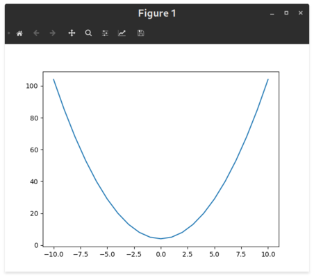

* Data science and data visualization for the win!


### pandas Flex (1/2)

* it is a data analysis and manipulation tool in Python
* Let's use the data manipulation part, and load an Excel spreadsheet
  - can also load boring CSVs, JSON, SQL (tables, queries), etc.
  - backend integration is waving

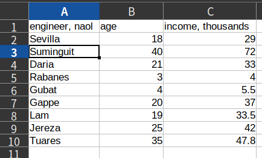


### pandas Flex (2/2)

```bash [1-2 | 3-13 | 15-16]
>>> import pandas as pd
>>> df = pd.read_excel('dummy.xlsx')
>>> df
  engineer, naol  age  income, thousands
0        Sevilla   18               29.0
1      Suminguit   40               72.0
2          Daria   21               33.0
3        Rabanes    3                4.0
4          Gubat    4                5.5
5          Gappe   20               37.0
6            Lam   19               33.5
7         Jereza   25               42.0
8         Tuares   35               47.8

>>> df['age'].to_numpy()
array([18, 40, 21,  3,  4, 20, 19, 25, 35])
```

* `df` means data-frame, a pandas structure
  - compatible with numpy, conversions usually unnecessary


### Jupyter Flex (1/10)

* Jupyter are digital notebooks that can combine 
  - explanatory text (Markdown)
    + explain insights about data
    + use 👇👇👇 to explain Python code, by parts
  - Math equations (LaTeX)
  - Python code snippets
    + all snippets are combined to form a single Python file
  - graphs, plots
  - export to HTML, PDF, and Python code (VSCode version)
  - did I mention it works inside VSCode?
  - Jupyter initially meant **Ju**lia, **Pyt**on, and **R**
    - but now works with tons of languages


### Jupyter Flex (2/10)

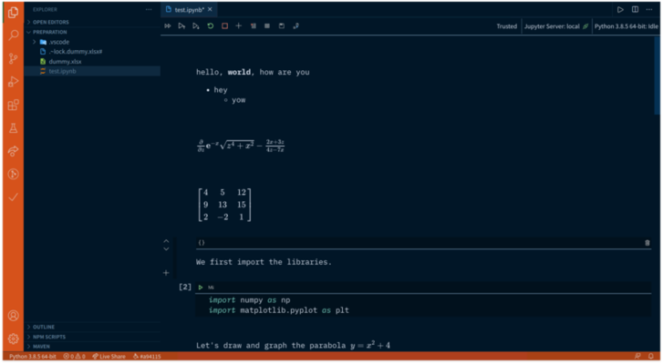

Markdown + equations using LaTex + some imports


### Jupyter Flex (3/10)

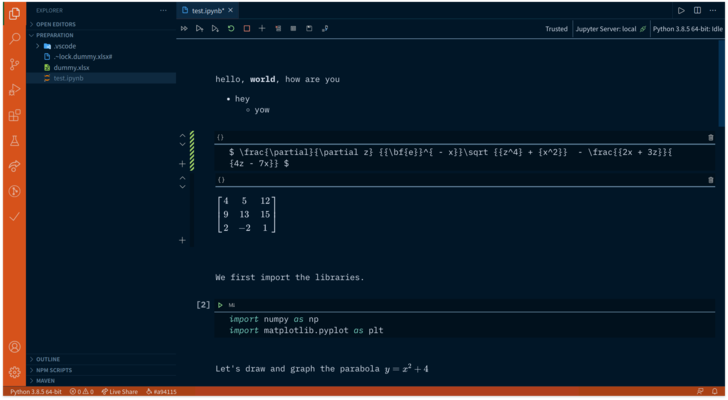

toggle between Markdown/LaTeX source and output


### Jupyter Flex (4/10)

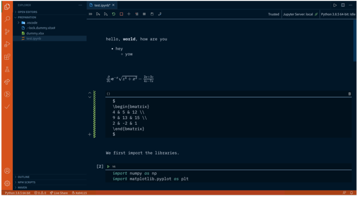

toggle between Markdown/LaTeX source and output


### Jupyter Flex (5/10)

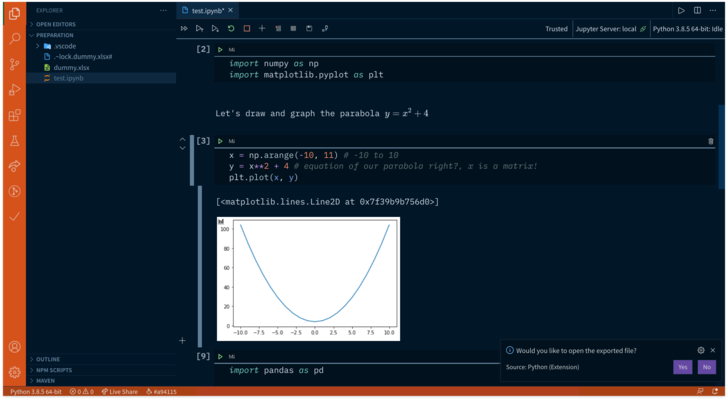

Embedded matplotlib output w/o a separate window


### Jupyter Flex (6/10)

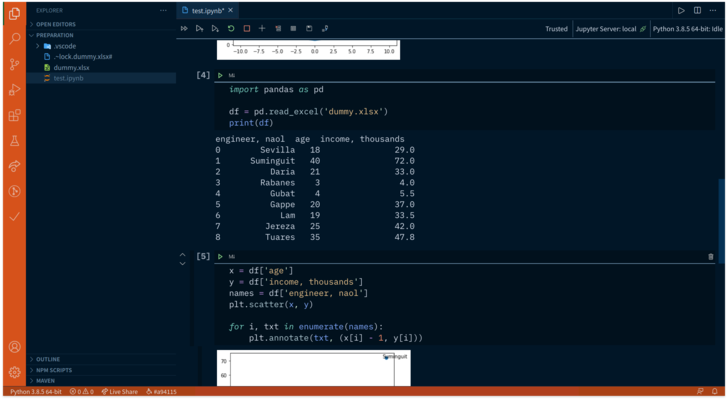

Dataframes from pandas can be `print`ed


### Jupyter Flex (7/10)

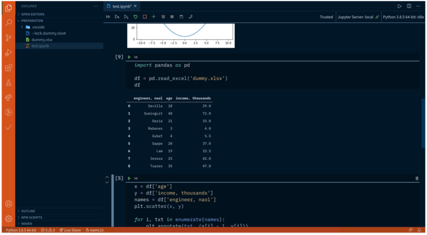

or just have the value hanging there (prettier IMO)


### Jupyter Flex (8/10)

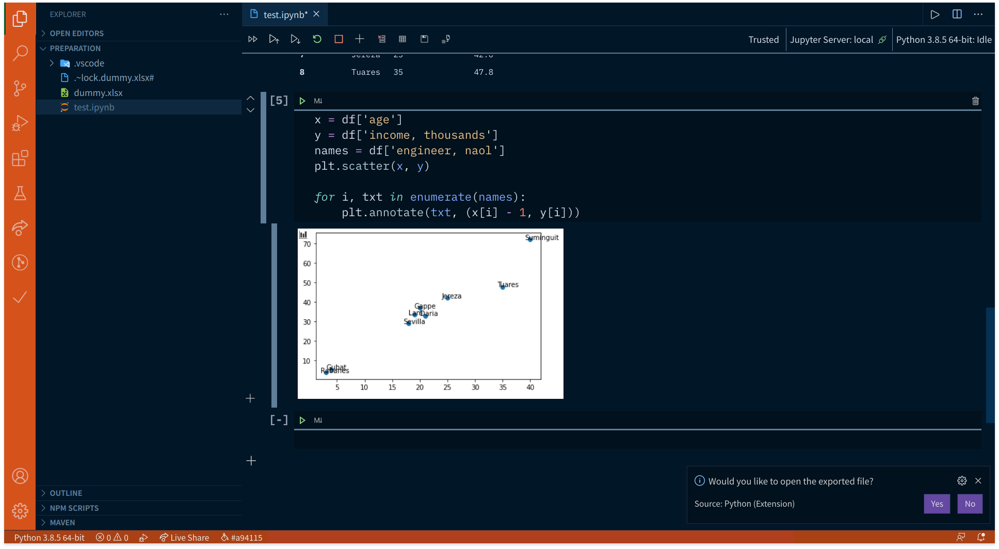 <!-- .element style="width: 728px; height: 400px" -->

scatter plot is a common way to visualize data in ML


### Jupyter Flex (9/10)

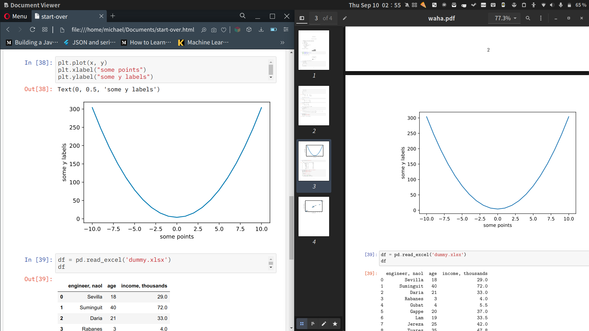 <!-- .element style="width: 728px; height: 400px" -->

Netlify-friendly with HTML export, PDF ain't bad too


### Jupyter Flex (10/10)

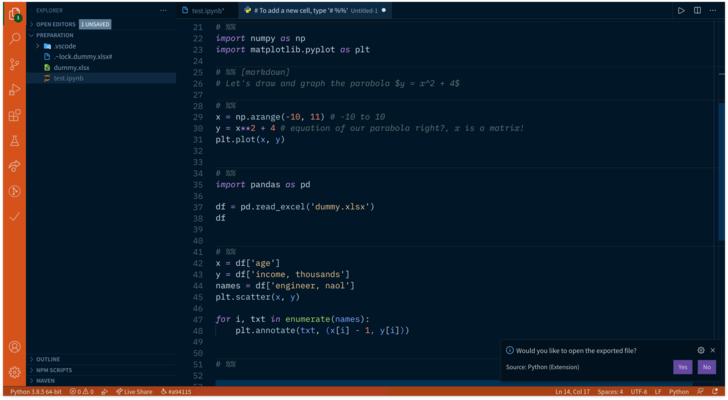

assemble scattered snippets back into a whole .py file
